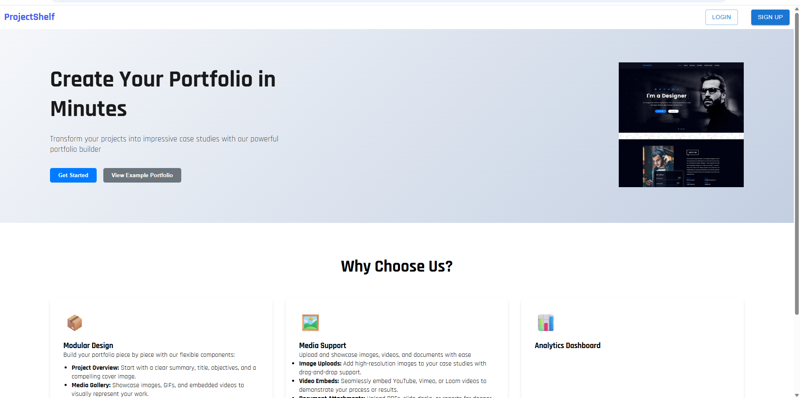

# ProjectShelf



ProjectShelf is a full-stack web application that allows developers and designers to create and manage their professional portfolios. Users can showcase their projects, case studies, and professional experience in a beautifully designed, customizable interface.

## Features

- **User Authentication**
  - Register and login functionality
  - Protected dashboard routes
  - Public portfolio viewing

- **Portfolio Management**
  - Create and manage case studies
  - Customize portfolio themes
  - Update profile settings
  - Public portfolio sharing with unique URLs

- **Case Study Features**
  - Detailed project documentation
  - Image uploads
  - Project descriptions
  - Technologies used
  - Live demo links

## Tech Stack

### Frontend
- React.js
- Material-UI (MUI)
- Framer Motion for animations
- React Router for navigation
- Axios for API requests
- Recharts for data visualization

### Backend
- Node.js
- Express.js
- MongoDB (with Mongoose)
- JWT for authentication

## Getting Started

### Prerequisites
- Node.js (v14 or higher)
- npm or yarn
- MongoDB instance

### Installation

1. **Clone the repository**
   ```bash
   git clone [repository-url]
   cd projectshelf
   ```

2. **Install Frontend Dependencies**
   ```bash
   npm install
   ```

3. **Install Backend Dependencies**
   ```bash
   cd backend
   npm install
   ```

4. **Environment Setup**
   Create `.env` files in both root and backend directories with necessary environment variables.

### Running the Application

1. **Start the Backend Server**
   ```bash
   cd backend
   npm start
   ```

2. **Start the Frontend Development Server**
   ```bash
   # In another terminal, from the root directory
   npm start
   ```

The application will be available at [http://localhost:3000](http://localhost:3000)

## Project Structure

```
projectshelf/
├── src/                    # Frontend source code
│   ├── components/         # Reusable React components
│   ├── pages/             # Page components
│   ├── context/           # React context providers
│   ├── services/          # API service integrations
│   └── utils/             # Utility functions
├── backend/               # Backend source code
│   ├── routes/            # API routes
│   ├── models/            # Database models
│   └── src/              # Core backend logic
└── public/               # Static assets
```

## Available Scripts

- `npm start` - Runs the frontend development server
- `npm test` - Runs the test suite
- `npm run build` - Creates a production build

## Usage Guide

1. **Registration/Login**
   - Create a new account or login with existing credentials
   - Access your personal dashboard

2. **Creating Your Portfolio**
   - Navigate to the dashboard
   - Add your profile information
   - Create case studies for your projects
   - Select and customize your portfolio theme

3. **Managing Case Studies**
   - Add detailed project information
   - Upload project images
   - Include technical specifications
   - Add live demo and repository links

4. **Sharing Your Portfolio**
   - Your portfolio is available at `/:username`
   - Individual case studies can be accessed at `/:username/project/:slug`

## Contributing

Please read [CONTRIBUTING.md](CONTRIBUTING.md) for details on our code of conduct and the process for submitting pull requests.

## License

This project is licensed under the MIT License - see the [LICENSE](LICENSE) file for details.
